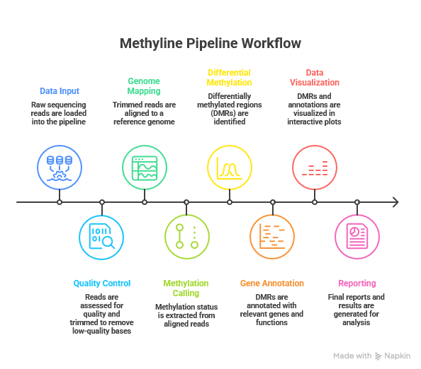

# 🧬 Methyline

> A modular Nextflow DSL2 pipeline for Enzymatic Methyl-seq (EM-seq) analysis

[](https://www.nextflow.io/)
[](https://www.docker.com/)

## Overview

**Methyline** is a reproducible bioinformatics workflow for EM-seq data analysis built with [Nextflow DSL2](https://www.nextflow.io/). The current pipeline covers the main stages of methylation analysis:

- raw read quality control and trimming
- bisulfite-aware alignment
- duplicate marking and methylation extraction
- methylome segmentation with MethylSeekR
- differential methylation analysis with DSS
- genomic and functional annotation of DMRs
- IGV-based visualisation and reporting

The workflow supports two execution modes:

- **comparative mode**: runs DSS on a design matrix to identify DMRs
- **single-sample mode**: skips DSS and focuses on methylome segmentation and annotation

---

## Pipeline Overview



---

## Current Workflow

| Step | Module | Description |
|------|--------|-------------|
| 1 | QC & Trimming | FastQC, Trim Galore!, MultiQC |
| 2 | Alignment | BWA-Meth alignment to the selected reference genome |
| 3 | Duplicate Marking | PCR duplicate marking on aligned BAM files |
| 4 | Methylation Extraction | MethylDackel methylation calls and bedGraph generation |
| 5 | Segmentation | MethylSeekR detection of PMDs, UMRs and LMRs |
| 6 | DMR Analysis | DSS differential methylation calling in comparative mode |
| 7 | Annotation | annotatr and rGREAT downstream interpretation |
| 8 | Visualisation | IGV snapshots and summary PDFs |

---

## Features

- **Modular design**: each analysis stage is implemented as an independent Nextflow module
- **Reproducible execution**: container support with Docker
- **EM-seq aware**: tool choices are adapted to methylation sequencing data
- **Flexible branching**: comparative and single-sample paths are both supported
- **Rich outputs**: PMD/UMR/LMR segmentation, DMR calls, annotation and PDF reports

---

## Requirements

- [Nextflow](https://www.nextflow.io/)
- [Docker](https://www.docker.com/)
- Java

The repository includes a Docker profile in `nextflow.config`.

---

## Quick Start

```bash
# Clone the repository
git clone https://github.com/negido/methyline.git
cd methyline

# Comparative analysis (with design matrix)
nextflow run main.nf \
  --reads 'test-data/*_{1,2}.fastq.gz' \
  --referenceGenome hg19 \
  --design_matrix 'design.tsv' \
  --analysisName analysis_test \
  -profile docker

# Segmentation-only analysis (no design matrix)
nextflow run main.nf \
  --reads 'test-data/*_{1,2}.fastq.gz' \
  --referenceGenome hg19 \
  --analysisName analysis_test \
  --single_sample true \
  -profile docker
```

---

## Input

The pipeline expects paired-end FASTQ files matched by a glob pattern. By default it uses:

```bash
test-data/*_{1,2}.fastq.gz
```

### Comparative mode

When running DSS, provide a design matrix with at least these columns:

| Column | Description |
|--------|-------------|
| `sample` | Sample identifier matching the FASTQ pair |
| `group` | Biological group or condition |

### Single-sample mode

No design matrix is required when `--single_sample true`.

---

## Main Parameters

| Parameter | Description | Default |
|-----------|-------------|---------|
| `--reads` | Glob pattern for paired FASTQ files | `test-data/*_{1,2}.fastq.gz` |
| `--referenceGenome` | Reference genome to use | `hg19` |
| `--analysisName` | Output folder name | `test_analysis` |
| `--design_matrix` | Design matrix for DSS | `''` |
| `--design` | Alternate alias for the design matrix | `''` |
| `--single_sample` | Skip DSS and run segmentation/annotation only | `false` |

Supported reference genomes in the current configuration are:

- `hg19`
- `hg38`

---

## Output

Outputs are published under the directory defined by `--analysisName`. The pipeline organises results by file type and functional interpretation across four main subdirectories:

**BED files** (`bed/`): Genomic region annotations generated by MethylSeekR, including:
- `*_UMRs.bed` - Unmethylated regions
- `*_LMRs.bed` - Low-methylated regions  
- `*_PMDs.bed` - Partially methylated domains

**HTML reports** (`html/`): Interactive visualisations and quality reports:
- `*_IGV.html` - Per-sample methylation profiles (igv-reports)
- `multiqc_report.html` - Aggregated quality control report

**PDF figures** (`pdf/`): High-resolution plots from segmentation and enrichment analysis:
- `*_segmentPMDs.pdf` - PMD segmentation plot
- `*_plotPMDSegmentation.pdf` - PMD example regions
- `*_segmentUMRsLMRs.pdf` - UMR/LMR segmentation
- `*_finalSegmentation.pdf` - Complete methylome segmentation summary
- `*_annotation_bar.pdf` - DMR annotation distribution (annotatr)
- `*_GREAT_*.pdf` - Functional enrichment plots (rGREAT)

**TSV tables** (`tsv/`): Data tables for downstream analysis:
- `DMRs.bed` - Differentially methylated regions
- `*_annotated.tsv` - Full DMR annotations with genomic context
- `*_annotation_summary.tsv` - DMR annotation summary by category
- `*_GREAT_enrichment.tsv` - Functional enrichment table (rGREAT)

---

## Modules Included

- `fastqc`
- `trimgalore`
- `multiQC`
- `bwamethAlign`
- `markDuplicates`
- `methylDackel`
- `methylseekr`
- `dss`
- `annotatr`
- `rgreat`
- `igv`

---


## Author

Developed as part of a Master's thesis in Bioinformatics.  
Contact: negido@uoc.edu
